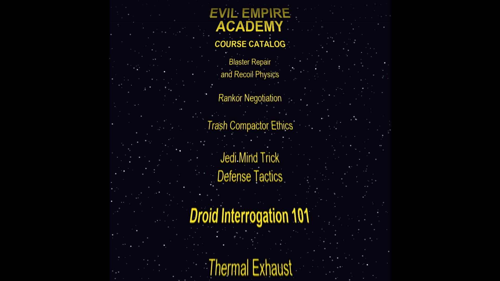

# Evil Empire Academy — Course Catalog Crawl

A Star Wars-style 3D perspective credit crawl showcasing the Evil Empire Academy's finest course offerings.

## 🎬 The Clip

<video src="EMPIRE_ACADEMY.mp4" controls width="100%" poster="screenshot.jpg"></video>

> **Duration:** 1:52 | **Resolution:** 1920×1080 | **Frame Rate:** 24fps | **Codec:** H.264

| Format | File | Size |
|--------|------|------|
| 🎥 MP4 (web) | [`EMPIRE_ACADEMY.mp4`](EMPIRE_ACADEMY.mp4) | 33MB |
| 🎬 MOV (source) | [`EMPIRE ACADEMY.mov`](EMPIRE%20ACADEMY.mov) | 127MB |

A scrolling text crawl with motion-blurred 3D perspective, starfield background, and the signature Star Wars yellow — built entirely with Python + OpenCV.

## 📚 Course Catalog

| Course | Department |
|--------|-----------|
| Blaster Repair and Recoil Physics | Weapons & Ordnance |
| Rankor Negotiation | Diplomacy & Creature Handling |
| Trash Compactor Ethics | Sanitation & Moral Philosophy |
| Jedi Mind Trick Defense Tactics | Psy-Ops Countermeasures |
| Droid Interrogation 101 | Intelligence & Robotics |
| Thermal Exhaust Shield Theory | Structural Engineering |
| Imperial Paperwork Avoidance | Bureaucratic Efficiency |
| Death Star Ergonomics | Workspace Optimization |

*And many, many more...*

## 🛠️ How It Was Made

- **Engine:** Custom Python renderer using OpenCV `warpPerspective` for correct 3D perspective (narrow at top, wide at bottom)
- **Frame Rate:** 24fps with 5× temporal supersampling motion blur for smooth scrolling
- **Resolution:** 1080×1080 square (cropped vertically for the crawl effect)
- **Audio:** TBD — ready for VO and soundtrack in DaVinci Resolve
- **Assembly:** Final composite in DaVinci Resolve Studio

### Technical Details

- Python script generates individual frames with twinkling starfield and yellow text
- OpenCV `getPerspectiveTransform` + `warpPerspective` for the 3D vanishing-point effect
- 5 sub-frames averaged per output frame for natural motion blur
- FFmpeg libx264 encoding (CRF 17, veryslow preset)
- Final output rendered in Resolve for audio + color grading

## 🚀 Usage

Drop into any 24fps timeline at 100% speed. Speed up in Resolve to taste. Add Imperial March (or your track of choice).
